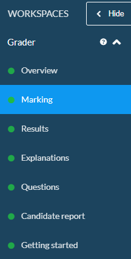
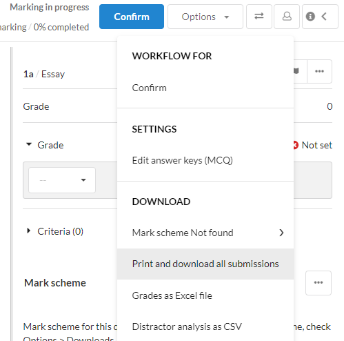
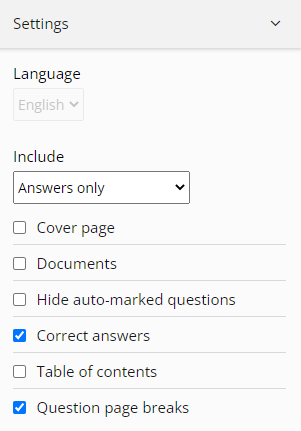
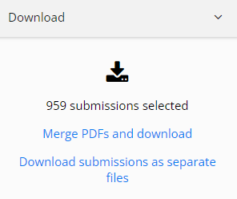

# CrowdMarkLoad
Imports an export from Inspera into CrowdMark

## Instructions

These instructions provide a high level overview of the process.
1. Download the student submissions from Inspera (see below)
1. Open a Chrome browser and navigate to the assignment
1. Add a settings file (see below)
1. (Optional) Add a question config file (see below)
1. Open the UiPath solution, and set the *configFile* argument for the **Validate the Starting State** activity
1. Start the process (I normally recommend testing one or two submissions before doing the full load)

## Inspera Download

To simplify the process, you will need to download the submissions from Inspera manually (yes, we probably could automate it, but the return on time spent would be low.)

Use the following steps to download the submissions:
1. Open a test/exam in Inspera
1. Go to `Marking` in the side bar

    
1. Select `Options`, then `Print and download all submission`

    
1. Open setting and select:
    - Include `Answers only`
    - Set `Question page breaks` to on
    - Set all other options to off (`Correct answers` can be on or off, it won't impact the import)

    
1. Select `Download submissions as seperate files`

    
1. Wait patiently (this can take a long time, especially for large classes)

## Setting File

The settings file is a plain text file that consists of three lines:
1. The location of the zip file containing all the submissions (this is the file that was downloaded from Inspera).
1. The number of questions (only required if there is no question config file).
1. The type of import to run. This can be one of two settings:
    - **PREPARE**: processes all the submission files and splits them into seperate folders for upload to CrowdMark
    - **FULL**: prepares the submissions (as per PREPARE) and then uploads to CrowdMark.

    The process tracks which files have been prepared and uploaded, so it it possible to PREPARE, check the files, then run FULL. You can also restart the process if it crashes for any reason.

    The import type can also take two optional parameters. The first parameters is the number of submissions to skip. The second is the number of submissions to process. These parameters must be seperated by a semi-colon (:).

The file must be called **ImportSettings.txt** and stored in **C:\Temp\CrowdMarkLoad**.

### Examples

Load a test with 16 questions and run a full prepare and import:
```
C:\Temp\MedSci201-2022-2.zip
16
FULL
```

Load a test with 5 questions and prepare the first two submissions:
```
C:\Temp\MedSci201-2022-2.zip
5
PREPARE:0:2
```

## Question Configuration File

The question configuration contains details on how the questions will be uploaded. It is a CSV file with the following columns:
* `Question`: the number of the question (required). Free text, but should be a number between one and the number of questions.
* `Mapping`: the CrowdMark question mapping (optional - defaults to "Q" plus the question number). Free text.
* `Skip`: the number of pages to skip (optional - defaults to 0). Must be a valid integer greater than or equal to zero.

The file must be called **questions.csv** and stored in **C:\Temp\CrowdMarkLoad**. (*TODO: make this a configuration setting in future.*)

## Related Projects

The [PdfSplitter](https://github.com/csut017/PdfSplitter) project provides a command-line utility for splitting a PDF file into smaller PDF files based on bookmarks in the PDF. The outputs from this tool are designed as inputs for the UiPath process in this project.

## Troubleshooting

TODO